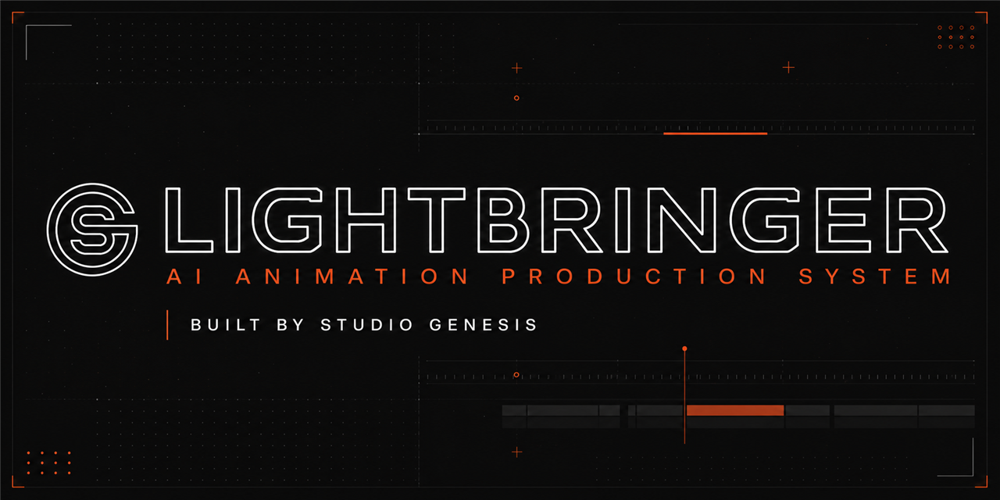
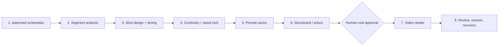
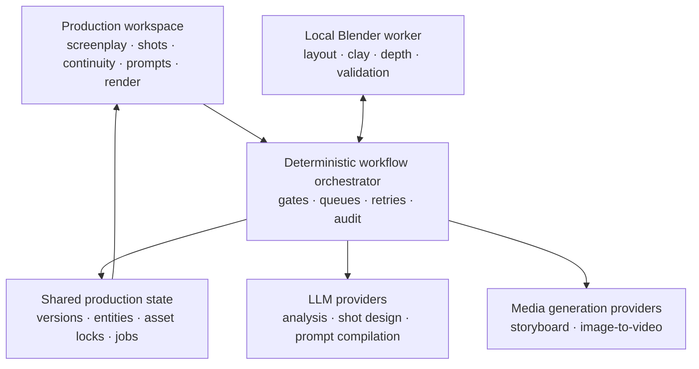

# LIGHTBRINGER

### A human-gated production operating system for AI animation



[한국어 소개](docs/README.ko.md) · [Workflow](docs/WORKFLOW.md) · [Architecture](docs/ARCHITECTURE.md) · [Industry impact](docs/INDUSTRY_IMPACT.md) · [Adoption guide](docs/ADOPTION_GUIDE.md)

**Proposed and architected by AI Creator BAO · Developed and operated by STUDIO GENESIS**

> LIGHTBRINGER is not another image or video model. It is the production control layer that turns approved screenplays into traceable, asset-consistent, cost-controlled animation work.

AI animation teams can generate individual shots quickly. Producing an entire episode is harder: story decisions drift, characters lose identity, prompts diverge, long scripts become impossible to navigate, and expensive video renders are repeated without a reliable approval trail.

LIGHTBRINGER was proposed and system-architected by **AI Creator BAO**, then developed by **STUDIO GENESIS** to solve that operational gap.

## The production problem

Most AI animation pipelines are assembled as a chain of disconnected tools:

```text
screenplay → chat prompt → image generation → video generation → folder of outputs
```

That is fast for a test shot but fragile for production. The process loses:

- screenplay approval and revision history;
- shot timing tied to recorded dialogue;
- character, prop, equipment, and location identity;
- continuity between adjacent shots;
- the relationship between Korean review text and English model input;
- failed-job recovery and output lineage;
- a human decision point before credit-intensive rendering.

LIGHTBRINGER treats those as production data, not loose text.

## The LIGHTBRINGER workflow



Each stage has one purpose and one clear completion condition.

1. **Approved screenplay** — writers and reviewers establish the source of truth.
2. **Segment analysis** — a long script is divided into safe, navigable work units without spending render credits.
3. **Shot design and timing** — an LLM proposes dialogue, visual direction, audio direction, performance, framing, camera, and approximate timing; humans can split, merge, edit, and lock every shot.
4. **Continuity and asset lock** — visible characters and locations are connected to versioned `@asset` identities before prompts are compiled.
5. **Prompt canon** — the system generates structured layers, a Korean review master, an English video master, a storyboard master, and shot-specific negatives.
6. **Storyboard and previz** — teams can validate composition with generated boards or deterministic 3D layouts.
7. **Human cost approval** — external rendering starts only after the team sees the target count and expected cost.
8. **Version and recovery** — completed work is preserved; failures and deleted shots can be retried without rebuilding the episode.

## What makes the system different

### 1. Approval depth instead of instant API consumption

Natural-language input is not sent through every model at once. Writers approve the screenplay, artists approve the shot plan, continuity is locked, prompts are reviewed, and only then does paid rendering begin.

### 2. Assets are identities, not attachments

Characters, creatures, locations, props, equipment, and 3D references live in an independent library. Production codes and human-readable `@aliases` keep the same entity synchronized across screenplay analysis, continuity, prompting, previz, and rendering.

### 3. Long-form work stays navigable

A 20-minute episode is not rendered as one enormous page or one fragile API response. The screenplay is segmented, the explorer shows only the selected unit, and queue status remains visible as `queued`, `running`, `completed`, or `failed`.

### 4. Fast batches with precise fallback

The normal path processes small shot batches for speed. If a batch fails or a response is truncated, the system falls back to individual shot recovery from the failure point. Completed shots are never discarded.

### 5. One positive language, two review surfaces

Shared style and negative rules are maintained once per scene. Each shot then receives:

- a structured seven-layer source;
- a Korean master for directors and reviewers;
- an English master for video generation;
- an English storyboard prompt for still-image generation;
- optional shot-specific negative instructions.

### 6. Deterministic previz before probabilistic rendering

Spatial layout, eyelines, character scale, the 180-degree rule, and camera placement are cheaper to validate in 3D than through repeated video generations. LIGHTBRINGER can use a local Blender worker for layout and validation, then pass approved clay/depth references downstream.

## Reference architecture



The orchestrator is deliberately deterministic. LLMs make bounded creative proposals; code controls permissions, state transitions, locks, cost approval, retry behavior, and audit history.

## Expected industry impact

LIGHTBRINGER is designed to improve outcomes that production teams can measure:

| Production risk | System response | Metric to track |
|---|---|---|
| Repeated renders caused by inconsistent identity | Versioned asset lock before prompt generation | Asset mismatch rate |
| API waste from premature generation | Human approval gates | Cost per approved second |
| Long-script UI overload | Segment explorer and selected-unit editing | Time to locate and revise a shot |
| Lost work after timeouts or malformed output | Persistent queues and shot-level fallback | Recovery time and retry rate |
| Review confusion between prompt and intention | Korean review master + English engine master | First-pass approval rate |
| Continuity drift across shots | Shot-level character/location state | Continuity issue rate |

These are expected effects and evaluation targets, not unverified performance claims. See the full [measurement framework](docs/INDUSTRY_IMPACT.md).

## Current status

LIGHTBRINGER is a working internal production system under active development at STUDIO GENESIS.

This public repository shares:

- the production philosophy;
- the workflow and data boundaries;
- the system architecture;
- adoption and evaluation guidance;
- open questions for the AI animation community.

It does **not** publish private production data, client materials, API credentials, or the commercial application source code.

## Who this is for

- animation studios testing generative production;
- directors and producers who need approval and auditability;
- storyboard and previz teams integrating AI tools;
- technical directors connecting LLM, image, video, and 3D systems;
- researchers studying human-in-the-loop creative production;
- vendors building models that need to fit real production workflows.

## Join the discussion

We welcome workflow critique, production case studies, metric proposals, and integration ideas.

- Read the [workflow specification](docs/WORKFLOW.md).
- Review the [adoption guide](docs/ADOPTION_GUIDE.md).
- Open an issue using the workflow-feedback template.
- Share a measured production bottleneck, not only a model preference.

## About STUDIO GENESIS

**AI Creator BAO** is the proposer and system architect of LIGHTBRINGER. **STUDIO GENESIS** develops and operates the AI-assisted animation production system, connecting human creative decisions with reproducible production data.

Website: [studiogenesis.co.kr](https://www.studiogenesis.co.kr)

## License and citation

The public documentation and diagrams in this repository are available under the [MIT License](LICENSE). `LIGHTBRINGER` and `STUDIO GENESIS` names and logos are excluded from the license grant.

For research or industry publications, see [CITATION.cff](CITATION.cff).
