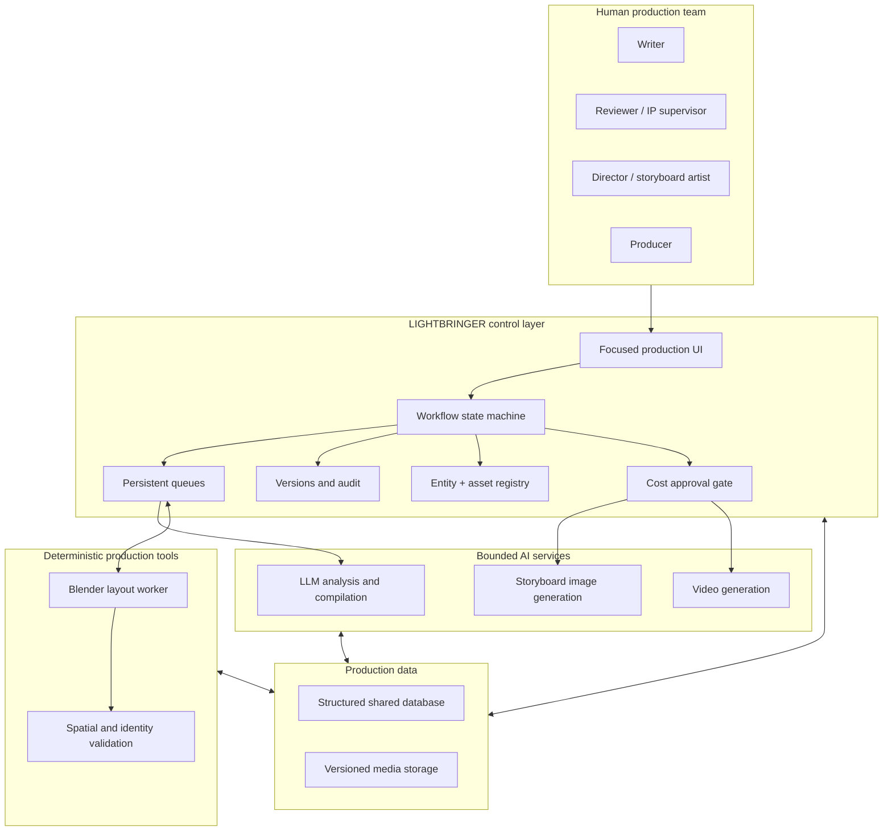
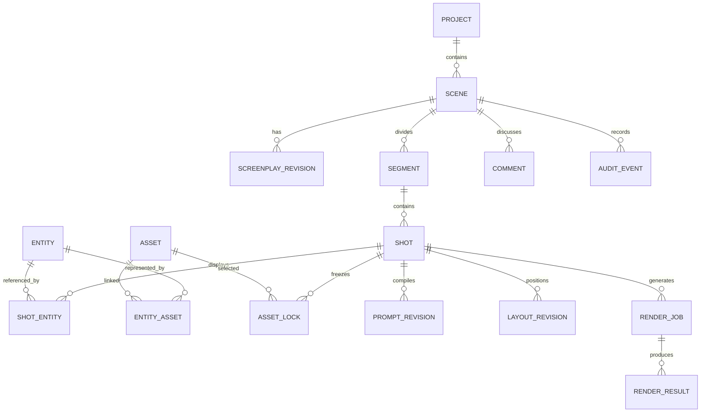

# Reference architecture

## System boundary

LIGHTBRINGER is a production orchestration layer positioned between creative teams and generative providers.

## Design principles

### Deterministic orchestration

LLMs should not own permissions, workflow transitions, job claiming, cost approval, version restoration, or audit history. Those are deterministic software responsibilities.

### Bounded model calls

Every request should have:

- a defined production stage;
- a limited source segment;
- a structured response schema;
- a known retry boundary;
- an immediately persisted result.

### Single source of identity

One entity registry should supply names and aliases to:

- screenplay analysis;
- shot entity lists;
- asset library matching;
- continuity locks;
- prompt compilation;
- 3D proxies and validation;
- render snapshots.

### Immutable render snapshots

A render attempt should reference the exact:

- screenplay revision;
- shot revision;
- asset versions;
- common prompt;
- shot prompt;
- negative prompts;
- layout or storyboard input;
- provider and model.

Later edits create a new attempt rather than rewriting the historical input.

## Suggested logical data model

## Provider abstraction

Production data should not depend on one vendor's response shape.

The system should normalize:

- provider availability;
- model selection;
- timeout and retry semantics;
- structured output parsing;
- token and cost metadata;
- provider error messages;
- media job status.

The provider adapter returns a canonical production result. The workflow layer decides what happens next.

## Local 3D worker pattern

Cloud applications cannot directly control a studio workstation running Blender. A safe pattern is outbound polling:

1. The local worker authenticates to LIGHTBRINGER.
2. It claims one queued layout or capture job with a lease.
3. It downloads coordinates and a deterministic script.
4. Blender renders clay, depth, or validation passes.
5. The worker uploads results and releases the claim.
6. Expired claims return to the queue.

This avoids inbound ports, fixed IP requirements, and duplicate execution.

## Security boundary

A commercial deployment should include:

- authenticated users and explicit invitations;
- least-privilege roles;
- owner-only destructive actions;
- server-side API keys;
- signed or authenticated media delivery;
- audit logs for login, permission, deletion, approval, and restore events;
- private object storage for production media;
- rate limits and budget ceilings;
- backup and recovery tests.

Public documentation must never include production credentials, client media, private prompts, or unreleased story content.
