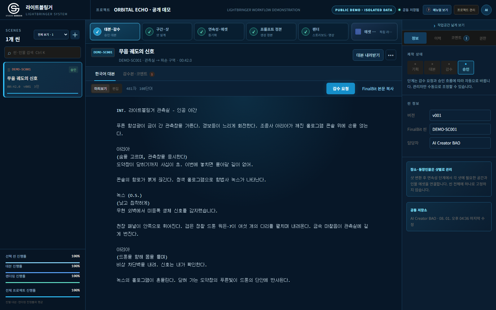
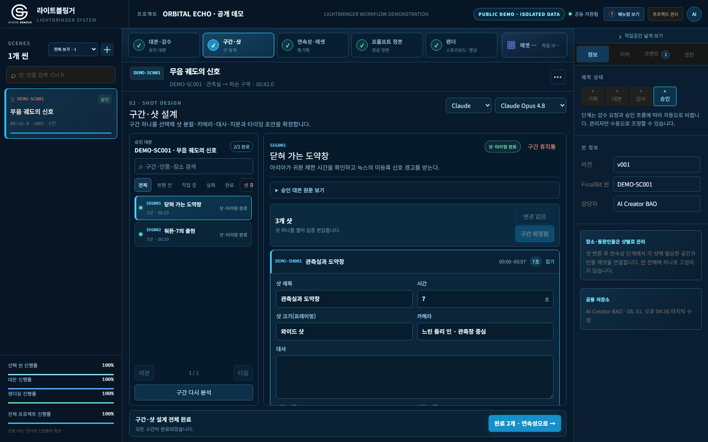
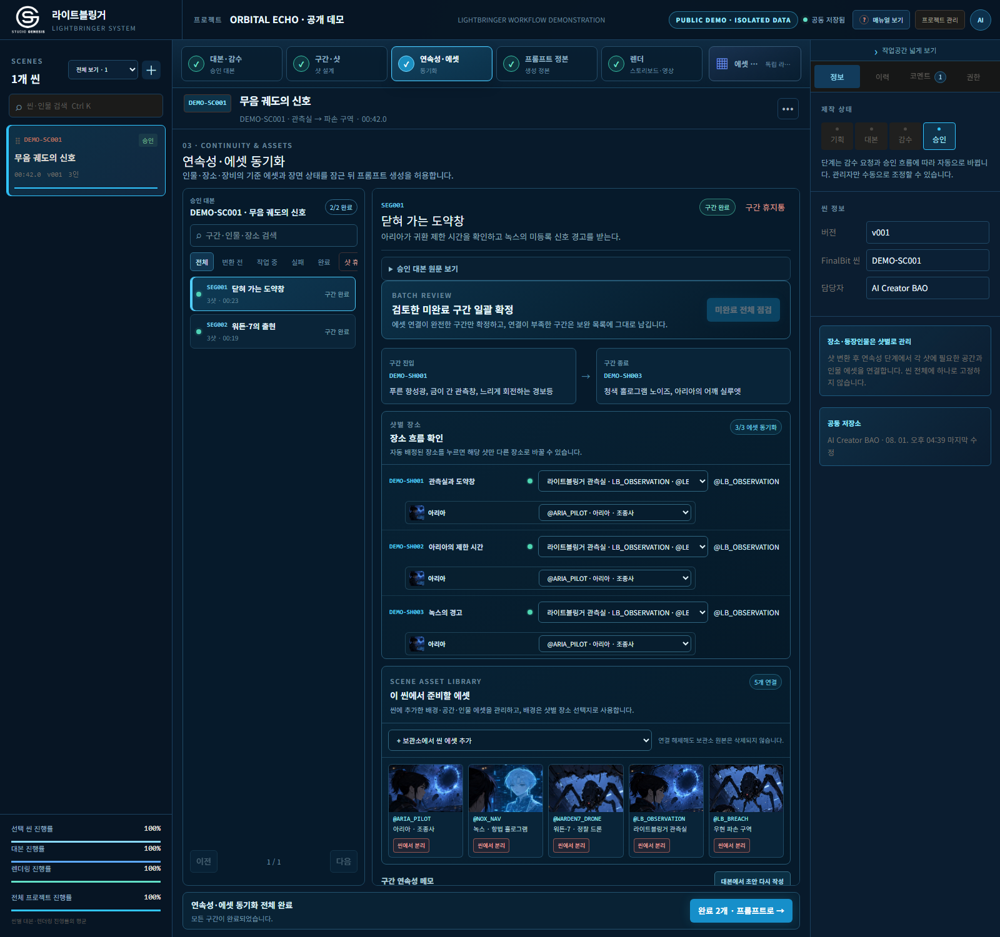
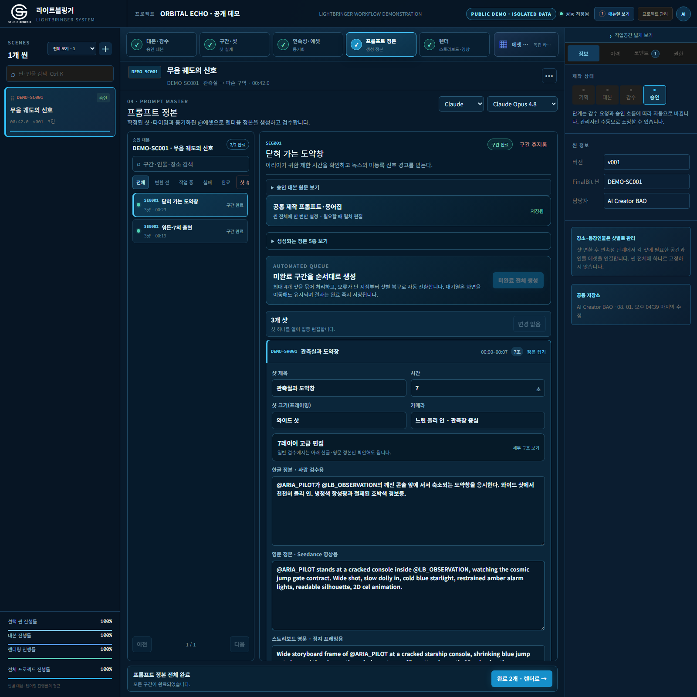
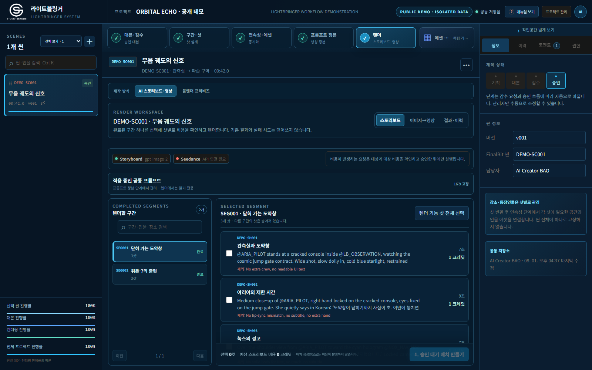

# Working demo case study — ORBITAL ECHO

This case study shows LIGHTBRINGER operating on an original, non-client screenplay. It was created to demonstrate the product without exposing an unreleased title, production asset, user account, or API credential.

> Proposed and system-architected by **AI Creator BAO** · Developed and operated by **STUDIO GENESIS**

## Demo scope

| Metric | Result |
| --- | ---: |
| Screenplay duration | 42 seconds |
| Safe work segments | 2 |
| Production shots | 6 |
| Character identities | 3 |
| Location identities | 2 |
| Synchronized reference assets | 5 |
| Prompt masters | 6 Korean + 6 English + 6 storyboard |
| Completed storyboard jobs shown | 3 |
| Failed stages | 0 |

The screenshots were captured from the working LIGHTBRINGER application using an isolated public-demo mode. The mode uses the same application UI, API contracts, data schemas, progression rules, asset bindings, prompt surfaces, and render-history components as production. Its output is deterministic so reviewers can reproduce the walkthrough without spending model or video credits.

## Original screenplay input

```text
INT. 라이트블링거 관측실 - 인공 야간

푸른 항성광이 금이 간 관측창을 가른다. 경보등이 느리게 회전한다.
조종사 아리아가 깨진 홀로그램 콘솔 위에 손을 얹는다.

아리아
(숨을 고르며, 관측창을 응시한다)
도약창이 닫히기까지 사십이 초. 이번에 놓치면 돌아갈 길이 없어.

콘솔의 항로가 붉게 끊긴다. 청색 홀로그램으로 항법사 녹스가 나타난다.

녹스 (O.S.)
(낮고 침착하게)
우현 외벽에서 미등록 생체 신호를 감지했습니다.

천장 패널이 안쪽으로 휘어진다. 검은 정찰 드론 워든-7이 여섯 개의
다리를 펼치며 내려온다. 금속 마찰음이 관측실에 길게 번진다.

아리아
(드론을 향해 몸을 틀며)
비상 차단벽을 내려. 신호는 내가 확인한다.

녹스의 홀로그램이 흔들린다. 닫혀 가는 도약창의 푸른빛이
드론의 단안에 반사된다.
```

The exact source is also available as [`examples/orbital-echo/input-screenplay.ko.txt`](../examples/orbital-echo/input-screenplay.ko.txt).

## 1. Approved screenplay

The screenplay is reviewed before any model-intensive production stage. The selected scene shows its source, approval state, assignee, duration, and comment history.



## 2. Segment explorer and shot timing

LIGHTBRINGER divides the 42-second scene into two stable work units. Each segment remains independently selectable, retryable, and reviewable. The selected segment exposes one shot at a time instead of expanding every shot in the episode.



Example output for `DEMO-SH002`:

| Field | Locked value |
| --- | --- |
| Duration | 9 seconds |
| Framing | Medium close-up |
| Camera | Locked camera with subtle handheld vibration |
| Dialogue | 아리아: 도약창이 닫히기까지 사십이 초. 이번에 놓치면 돌아갈 길이 없어. |
| Visual direction | Red console error light reflects under Aria's face |
| Audio direction | Controlled breath and console error tone |

The machine-readable sample is available at [`examples/orbital-echo/shot-output.sample.json`](../examples/orbital-echo/shot-output.sample.json).

## 3. Continuity and asset synchronization

Characters and locations are production identities, not names pasted into prompts. Each shot can use a different subset of scene assets. The green indicators show that the selected shot's visible character and location identities are bound.



Demo identities:

- `@ARIA_PILOT` — Aria, starship pilot;
- `@NOX_NAV` — Nox, cyan navigation hologram;
- `@WARDEN7_DRONE` — Warden-7, six-legged reconnaissance drone;
- `@LB_OBSERVATION` — LIGHTBRINGER observation room;
- `@LB_BREACH` — damaged starboard ceiling zone.

## 4. Prompt master

Prompt generation begins only after timing and continuity are ready. Shared style, terminology, and negatives are defined once. Every shot then receives seven structured layers plus three review surfaces:

- Korean master for human review;
- English master for video generation;
- English storyboard master for a still frame;
- shot-specific negative additions.



The complete sample structure is available at [`examples/orbital-echo/prompt-master.sample.json`](../examples/orbital-echo/prompt-master.sample.json).

## 5. Render cost gate and result history

Render requests show eligible shots and estimated credits before execution. Completed attempts remain grouped by shot so regeneration never erases the earlier result.




### Demo storyboard contact sheet


The concept frames are original demo material. They do not use a client title, existing character, or unreleased production asset.

## What this demonstrates

LIGHTBRINGER is not presented as another generation model. The demo proves the operating layer around multiple models:

1. a reviewed screenplay remains the source of truth;
2. long-form work is navigated through stable segments;
3. dialogue, visual direction, audio direction, performance, camera, and timing are editable production fields;
4. character and location identity is locked before prompt compilation;
5. Korean review intent and English generation input remain traceable;
6. credit-intensive rendering requires a human approval gate;
7. outputs, retries, and failures retain lineage.

## Reproduction boundary

The commercial application source, credentials, private database, and client media are not included in this repository. The public example contains sanitized inputs, representative outputs, screenshots, and schemas for workflow evaluation. Teams can use the [adoption guide](ADOPTION_GUIDE.md) to map the same stages onto their own stack.
