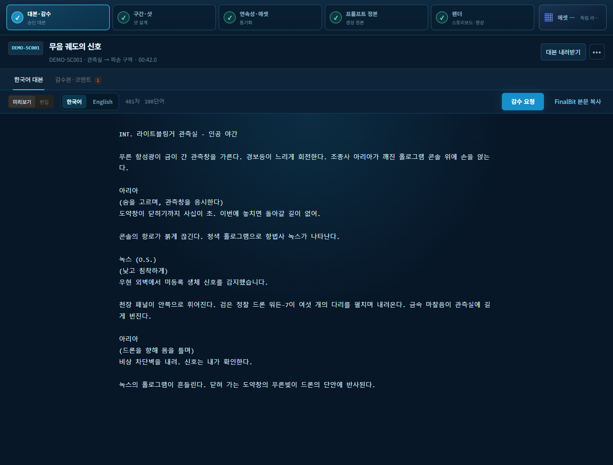
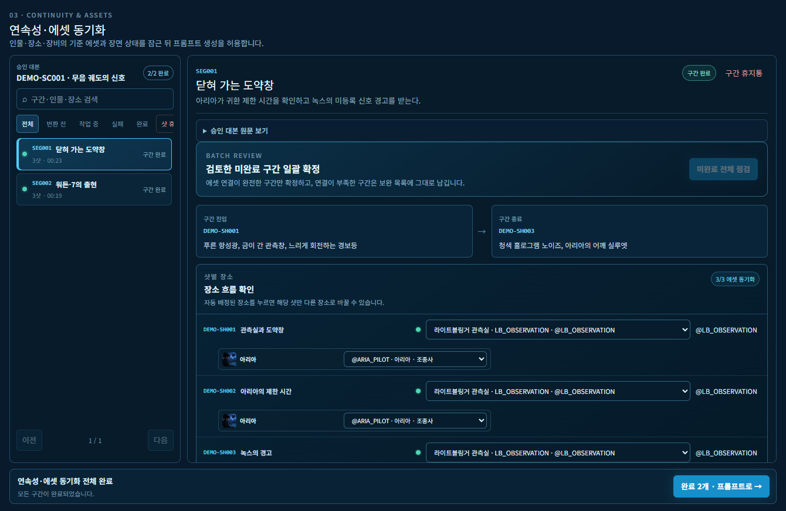
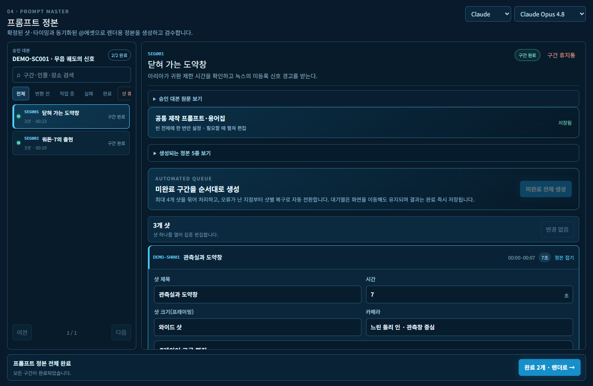
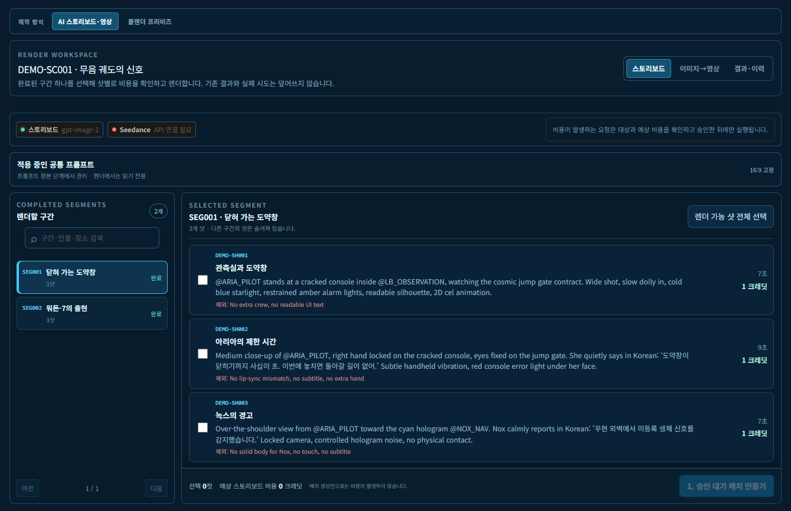
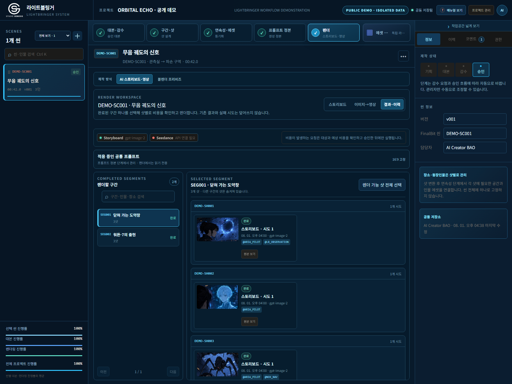

# 라이트블링거 60초 제품 투어

[한국어](QUICK_TOUR.ko.md) · [English](QUICK_TOUR.md) · [전체 실행 사례](DEMO_CASE_STUDY.ko.md)

42초 분량의 오리지널 장면이 여섯 가지 제작 결정을 거칩니다. 모든 화면은 실제 애플리케이션의 격리된 공개 데모 모드에서 캡처했습니다.

## 1. 하나의 제작 원문 승인

작가와 감수자는 한국어 대본과 영문본을 별도로 보존합니다. 마지막으로 복사한 프롬프트가 아니라 승인된 대본에서 제작을 시작합니다.



## 2. 구간을 탐색하고 한 샷만 편집

긴 대본을 순서가 고정된 작업 구간으로 나눕니다. 탐색기에서 전체 순서와 상태를 확인하되 편집기는 선택한 샷의 타이밍, 카메라, 대사, 시각·청각 지문만 엽니다.


## 3. 프롬프트보다 먼저 연속성 잠금

각 샷에 실제로 보이는 인물과 장소를 지정하고 버전이 있는 `@에셋`에 연결합니다. 같은 씬 안에서도 샷마다 다른 에셋 조합을 사용할 수 있습니다.



## 4. 사람의 의도와 엔진 입력을 함께 검수

공통 스타일과 네거티브는 한 번만 정의합니다. 각 샷은 한글 검수 정본, 영문 영상 정본, 스토리보드 정본, 구조화 레이어와 샷별 네거티브를 함께 보존합니다.



## 5. 비용을 승인한 뒤 모든 결과 보존

유료 요청 전에 대상 샷과 예상 크레딧을 확인합니다. 완료·실패·재생성 결과는 서로 덮어쓰지 않고 이력으로 남습니다.





## 결과

```text
42초 승인 대본
→ 탐색 가능한 2개 구간
→ 수정 가능한 6개 제작 샷
→ 동기화된 인물·장소 정체성 5개
→ 한글·영문 프롬프트 정본
→ 보존된 스토리보드 결과 3개
→ 실패한 워크플로우 단계 0개
```

[전체 실행 사례 보기 →](DEMO_CASE_STUDY.ko.md) · [예제 데이터 열기 →](../examples/orbital-echo/README.md)
