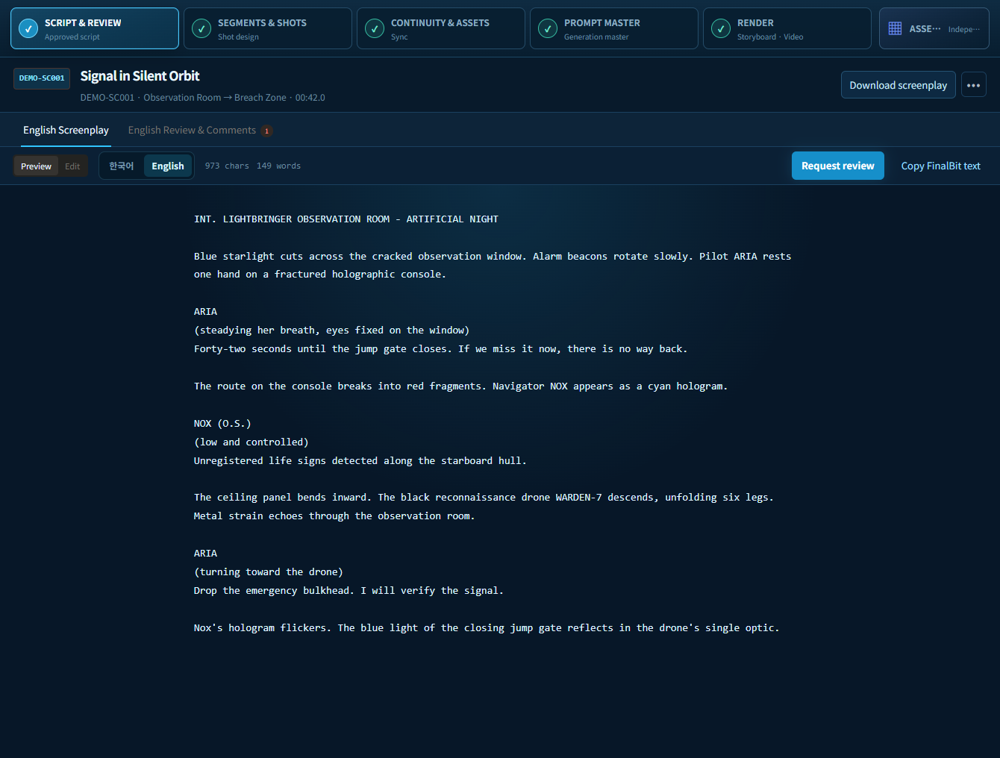
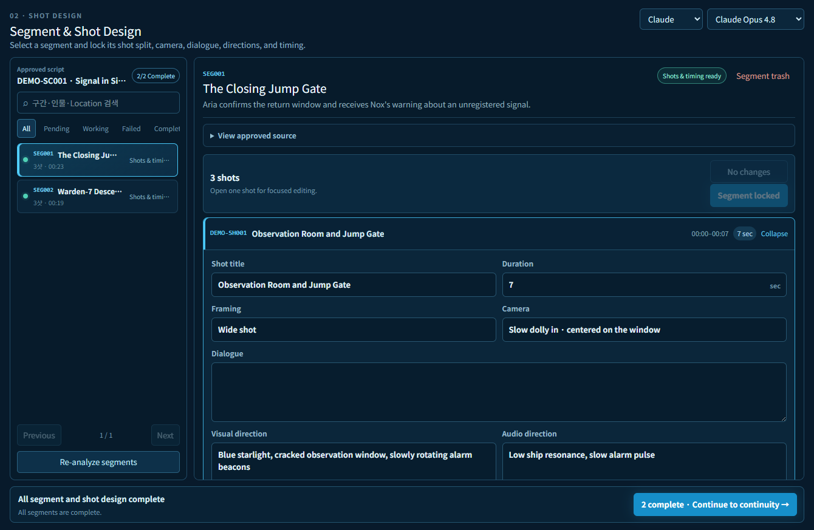
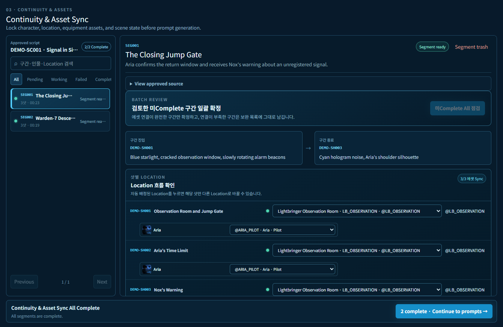
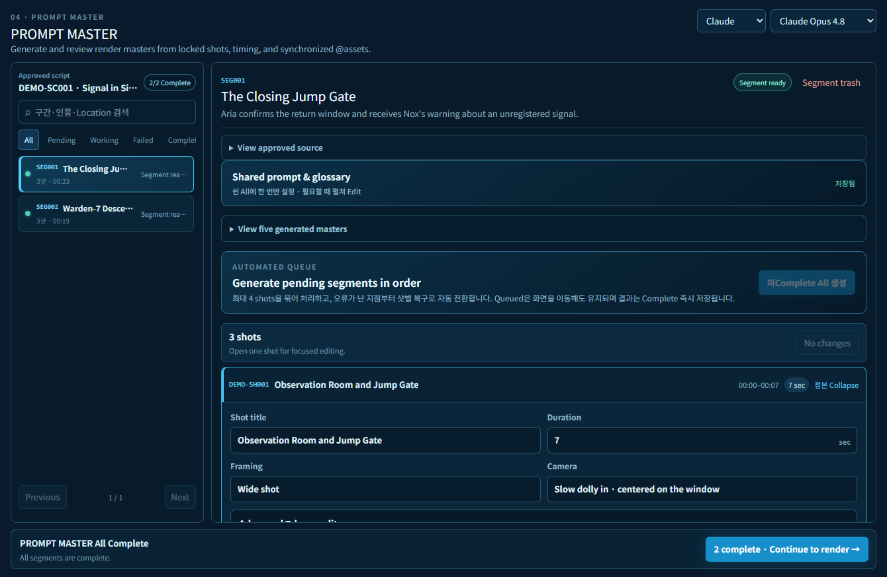
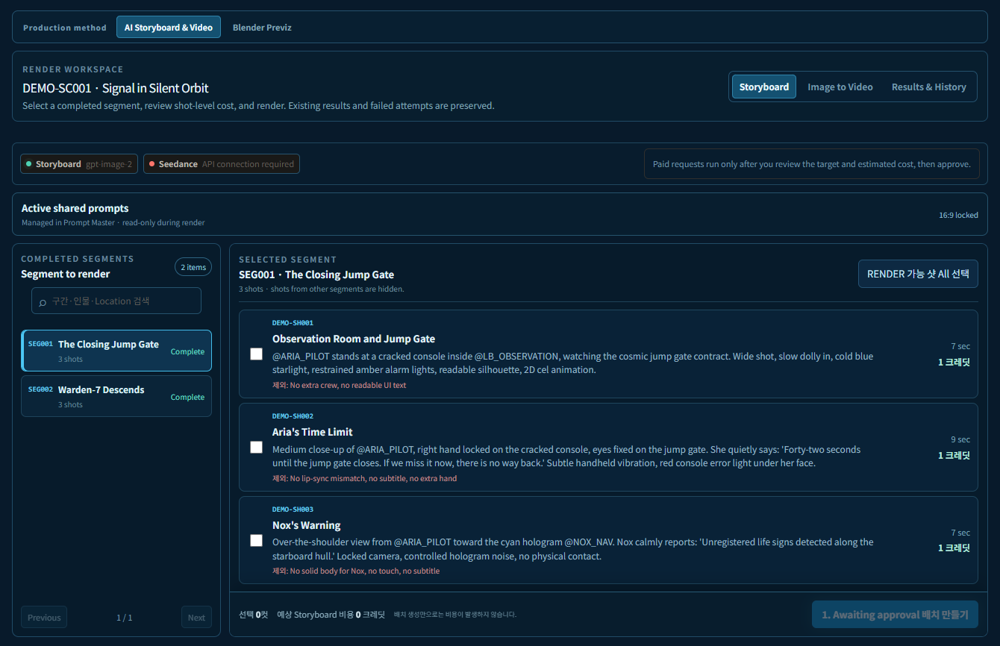
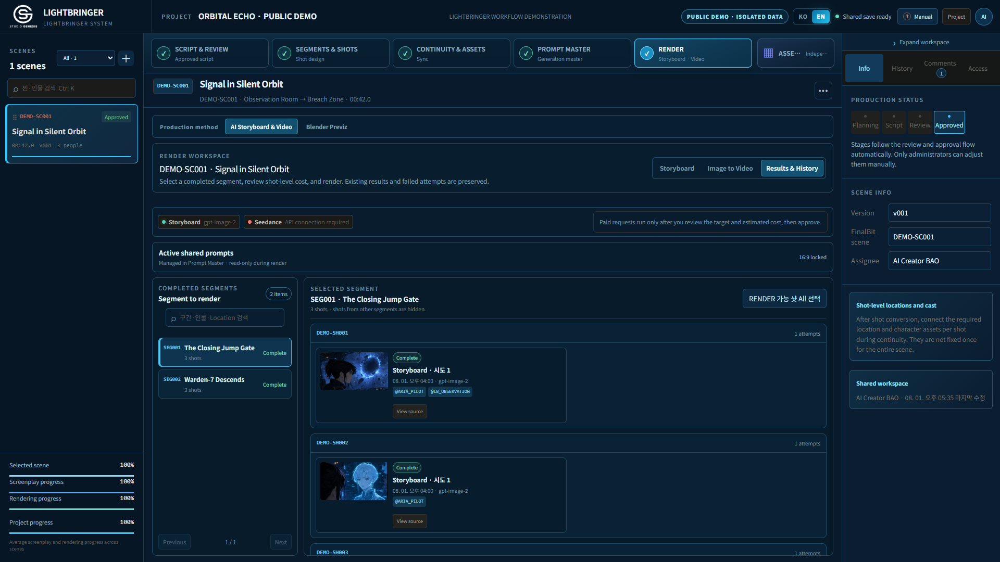

# LIGHTBRINGER in 60 seconds

[English](QUICK_TOUR.md) · [한국어](QUICK_TOUR.ko.md) · [Full case study](DEMO_CASE_STUDY.md)

One original 42-second scene moves through six production decisions. The screenshots come from the working application in isolated public-demo mode.

## 1. Approve one source of truth

Writers and reviewers keep Korean and English screenplay versions separately. Production starts from an approved version, not from whichever prompt was pasted most recently.



## 2. Navigate segments, then edit one shot

The long script becomes stable work segments. The explorer shows the sequence and status while the editor opens only the selected shot's timing, camera, dialogue, visual, and audio direction.



## 3. Lock continuity before prompting

Every shot declares the characters and location it actually shows. Those identities connect to versioned `@assets`, so one scene can use different asset combinations from shot to shot.



## 4. Review intent and engine input together

Shared style and negatives are defined once. Each shot keeps a Korean review master, an English video master, a storyboard master, structured layers, and shot-specific negatives.



## 5. Approve cost, then preserve every result

The team sees eligible shots and estimated credits before a paid request. Completed, failed, and regenerated attempts remain in history instead of overwriting one another.





## Result

```text
42-second screenplay
→ 2 navigable segments
→ 6 editable production shots
→ 5 synchronized character/location identities
→ bilingual prompt masters
→ 3 preserved storyboard outputs
→ 0 failed workflow stages
```

[Inspect the complete case study →](DEMO_CASE_STUDY.md) · [Open the example data →](../examples/orbital-echo/README.md)
