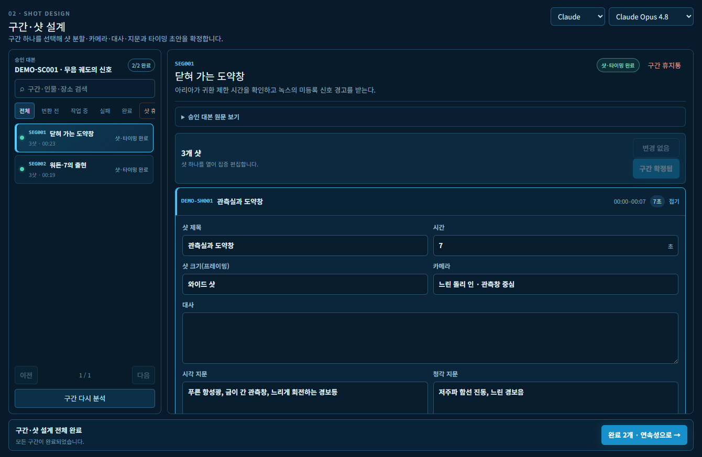

# 라이트블링거

## 승인 대본을 에셋이 일관되고 비용이 통제되는 AI 애니메이션 제작으로 연결합니다

[한국어](README.ko.md) · [English](../README.md)

[**공개 데모 실행 →**](#공개-데모-실행) · [60초 제품 투어](QUICK_TOUR.ko.md) · [실제 작동 사례](DEMO_CASE_STUDY.ko.md) · [워크플로우](WORKFLOW.md) · [토론](https://github.com/jangrno123/lightbringer-ai-animation-system/discussions)

**제안·시스템 설계: AI Creator BAO · 개발·운영: STUDIO GENESIS**

> 라이트블링거는 승인 대본과 이미지·영상 생성 엔진 사이의 제작 통제 시스템입니다. 샷을 수정 가능한 데이터로 유지하고, 인물과 장소의 정체성을 동기화하며, 비용과 승인·재시도 이력을 보존합니다.

## 실제 작동 화면

독립 공개 데모 **ORBITAL ECHO**는 42초 분량의 오리지널 장면을 실제 라이트블링거 워크플로우로 실행한 사례입니다. 고객 작품, 계정, 비밀키와 외부 모델 비용을 노출하지 않도록 격리된 고정 데이터를 사용했습니다.



| 대본 | 구간 | 샷 | 에셋 정체성 | 스토리보드 결과 | 실패 단계 |
| ---: | ---: | ---: | ---: | ---: | ---: |
| 42초 | 2개 | 6개 | 5개 | 3개 | 0개 |

먼저 [60초 제품 투어](QUICK_TOUR.ko.md)를 보고, 전체 [한국어](DEMO_CASE_STUDY.ko.md) 또는 [English](DEMO_CASE_STUDY.md) 실행 사례를 확인해 주세요.

## 공개 데모 실행

이 저장소에는 오리지널 더미 데이터로 작동하는 별도의 배포용 데모가 포함되어 있습니다. 로컬에서는 Node.js 20 이상만 있으면 실행할 수 있습니다.

```bash
npm start
```

`http://localhost:4173`을 엽니다. 기본 Mock API는 비용이 전혀 들지 않습니다. 사용자 소유 LLM을 연결할 때는 키를 브라우저가 아니라 서버 비밀 환경변수에 저장하고 Anthropic 또는 OpenAI 호환 어댑터를 선택합니다.

[자체 호스팅·사용자 API 연결 안내 →](SELF_HOSTED_DEMO.ko.md)

## 무엇을 하는 시스템인가

```text
승인 대본
   ↓
구간 탐색기 → 샷 설계·타이밍
   ↓
연속성 → 버전이 있는 @에셋 정체성 잠금
   ↓
사람 검수용 한글 정본 + 생성 엔진용 영문 정본
   ↓
스토리보드·프리비즈 → 사람의 비용 승인 → 영상 렌더
   ↓
결과 이력·재시도·버전·복구
```

| 제작 단계 | 사람이 결정하는 것 | 시스템이 보존하는 것 |
| --- | --- | --- |
| 대본 | 작가와 감수자가 제작 원문 승인 | 버전 대본과 감수 이력 |
| 샷 설계 | 분할, 카메라, 대사, 지문, 타이밍 수정 | 탐색 가능한 샷 데이터 |
| 연속성 | 샷마다 보이는 인물과 장소 확인 | 잠긴 `@에셋`과 장면 상태 |
| 프롬프트 | 생성 전에 감독이 연출 의도 검수 | 한글·영문 영상·스토리보드 정본 |
| 렌더 | 대상과 예상 비용 확인 후 승인 | 결과·시도·실패·재생성 계보 |

## 왜 필요한가

AI로 한 개의 샷을 만드는 것은 빠르지만, 한 편의 에피소드를 일관되게 만드는 것은 제작 운영의 문제입니다.

| 제작 문제 | 라이트블링거의 통제 방식 |
| --- | --- |
| 샷마다 인물과 장소가 달라짐 | 버전이 있는 샷별 에셋 잠금 |
| 긴 대본이 수백 카드로 펼쳐짐 | 선택 구간 하나만 여는 탐색기 |
| LLM 출력이 잘리거나 시간 초과 | 빠른 묶음 처리 후 실패 지점만 개별 복구 |
| 한국어 의도와 영문 입력이 달라짐 | 검수 정본과 생성 정본을 병렬 보존 |
| 검토 전에 비싼 렌더를 반복 | 비용 발생 전에 사람 승인 |
| 재시도·삭제 중 완료 작업 소실 | 이력·휴지통·복구·결과 계보 보존 |

세부 규칙은 [워크플로우](WORKFLOW.md)와 [아키텍처](ARCHITECTURE.md)에서 확인할 수 있습니다.

## 공개 범위

이 저장소는 **공개 워크플로우 명세, 실제 작동 사례와 별도로 구현한 실행형 더미 데모**입니다. 상용 애플리케이션 전체 소스 배포 저장소는 아닙니다.

공개하는 것:

- 실제 애플리케이션의 한글·영문 화면;
- 저작권 문제가 없는 오리지널 대본과 샷 데이터;
- 한글·영문 프롬프트 정본 예제;
- 배포 가능한 더미 UI, 비용 없는 Mock API와 서버측 사용자 API 어댑터;
- 워크플로우, 아키텍처, 도입·평가 문서;
- 제작 피드백을 위한 이슈 양식.

공개하지 않는 것:

- 고객사와 미공개 작품 데이터;
- 레퍼런스 원본과 비공개 에셋 보관소;
- 계정·감사 이력·관리자 경로·API 키;
- 상용 라이트블링거 애플리케이션 전체 소스.

## 어디서 시작할까

| 확인 목적 | 시작 문서 |
| --- | --- |
| 제품을 빠르게 이해 | [60초 제품 투어](QUICK_TOUR.ko.md) |
| 전체 실행 결과 확인 | [실제 작동 사례](DEMO_CASE_STUDY.ko.md) |
| 제작 규칙 확인 | [워크플로우](WORKFLOW.md) |
| 시스템 경계 검토 | [아키텍처](ARCHITECTURE.md) |
| 다른 제작 환경에 도입 | [도입 가이드](ADOPTION_GUIDE.md) |
| 성과 측정 기준 확인 | [업계 효과와 지표](INDUSTRY_IMPACT.md) |
| 데이터 예제 확인 | [`examples/orbital-echo`](../examples/orbital-echo/README.md) |
| 안전하게 실행하거나 자체 API 연결 | [자체 호스팅 데모 안내](SELF_HOSTED_DEMO.ko.md) |

## 현재 상태와 참여

라이트블링거는 STUDIO GENESIS에서 실제 내부 제작 시스템으로 개발 중입니다. 공개 저장소는 현재 한·영 실제 작동 데모 릴리스를 준비하고 있습니다.

- [로드맵](../ROADMAP.md)과 [변경 이력](../CHANGELOG.md)을 확인해 주세요.
- [제작 병목 피드백](https://github.com/jangrno123/lightbringer-ai-animation-system/issues/new?template=workflow-feedback.yml)을 남길 수 있습니다.
- 폭넓은 제안은 [GitHub Discussions](https://github.com/jangrno123/lightbringer-ai-animation-system/discussions)에서 나눌 수 있습니다.
- 변경 제안 전 [CONTRIBUTING.md](../CONTRIBUTING.md)를 확인해 주세요.

## STUDIO GENESIS

**AI Creator BAO**가 라이트블링거를 제안하고 시스템을 설계했으며, **STUDIO GENESIS**가 개발·운영합니다.

[STUDIO GENESIS 홈페이지](https://www.studiogenesis.co.kr) · [인용 정보](../CITATION.cff) · [라이선스](../LICENSE)
