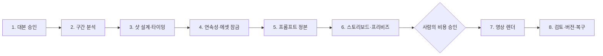

# 라이트블링거

## AI 애니메이션을 위한 인간 승인형 제작 운영 시스템

**제안·시스템 설계: AI Creator BAO · 개발·운영: STUDIO GENESIS**

라이트블링거는 이미지나 영상을 생성하는 새로운 모델이 아닙니다. **승인된 대본을 추적 가능하고, 에셋이 일관되며, 비용을 통제할 수 있는 애니메이션 제작 데이터로 바꾸는 운영 시스템**입니다.

AI로 한두 개의 멋진 샷을 만드는 것은 빠릅니다. 하지만 한 편의 에피소드를 만들기 시작하면 문제가 달라집니다.

- 작가가 승인한 대본과 생성 결과가 멀어집니다.
- 같은 인물과 장소가 샷마다 달라집니다.
- 긴 대본이 수백 개의 카드로 펼쳐져 작업자가 길을 잃습니다.
- 프롬프트의 한국어 의도와 생성기에 전달된 영문이 달라집니다.
- 실패한 API 호출 때문에 이미 완료된 샷까지 다시 만들어집니다.
- 비싼 영상 렌더가 충분한 검토 없이 반복됩니다.

**AI Creator BAO**가 이 제작 병목을 해결하기 위해 라이트블링거를 제안하고 시스템을 설계했으며, **STUDIO GENESIS**가 이를 개발하고 운영합니다.

## 한눈에 보는 제작 흐름

### 1. 대본 승인

작가와 감수자가 대본을 주고받아 제작 기준이 되는 승인본을 만듭니다.

### 2. 구간 분석

긴 대본을 한 번에 API로 보내지 않고, 대사 블록과 장면 흐름을 보존한 안전한 작업 구간으로 나눕니다.

### 3. 샷 설계·타이밍

LLM은 대사, 시각 지문, 청각 지문, 행동·연기, 프레이밍, 카메라, 예상 시간을 제안합니다. 작업자는 샷을 나누거나 합치고, 시간을 1초 단위로 조정한 뒤 확정합니다.

### 4. 연속성·에셋 잠금

각 샷에 실제로 등장하는 인물과 장소를 확인하고 보관소의 `@에셋명`과 연결합니다. 프롬프트를 만들기 전에 정체성을 먼저 잠그는 단계입니다.

### 5. 프롬프트 정본

시스템은 공통 룩과 공통 네거티브를 한 번만 관리하고, 샷마다 다음 결과를 만듭니다.

- 7레이어 구조화 원본
- 감독과 감수자를 위한 한글 정본
- 영상 생성기를 위한 영문 정본
- 정지 스토리보드를 위한 영문 정본
- 해당 샷에만 필요한 추가 네거티브

### 6. 스토리보드·프리비즈

생성형 스토리보드 또는 Blender 기반의 결정론적 구도를 이용해 카메라, 위치, 시선, 인물 크기와 동선을 확인합니다.

### 7. 영상 렌더

대상 샷 수와 예상 비용을 확인한 뒤 사람이 승인해야 외부 영상 API가 실행됩니다.

### 8. 검토·버전·복구

성공과 실패 결과를 덮어쓰지 않고 보관합니다. 실패한 구간이나 삭제한 샷만 복구·재생성할 수 있습니다.

## 라이트블링거의 핵심 원칙

1. **돈이 드는 결정 앞에는 사람이 선다.**
2. **LLM은 제안하고, 상태 전이와 권한은 코드가 통제한다.**
3. **에셋은 첨부파일이 아니라 제작 전 단계에서 공유하는 정체성이다.**
4. **긴 작품은 전체 노출이 아니라 탐색기와 선택 작업으로 다룬다.**
5. **완료 결과는 보존하고 실패한 지점만 재시도한다.**
6. **확률적 영상 렌더 전에 결정론적 프리비즈로 공간 문제를 줄인다.**
7. **원작 감수, 연출 판단, 제작 승인을 자동 검증으로 대체하지 않는다.**

## 업계에서 기대할 수 있는 효과

과장된 절감률을 먼저 주장하지 않습니다. 대신 아래 지표를 제작 전후로 측정해야 합니다.

| 확인할 지표 | 의미 |
|---|---|
| 승인 영상 1초당 비용 | 실제로 채택된 결과를 만드는 데 사용한 전체 생성 비용 |
| 프롬프트 재시도율 | 같은 샷에서 프롬프트를 다시 만든 비율 |
| 렌더 재생성률 | 기술 또는 연출 문제로 영상을 다시 생성한 비율 |
| 에셋 불일치율 | 인물·의상·장비·장소가 기준 시트와 달라진 비율 |
| 첫 검토 승인율 | 첫 결과가 추가 생성 없이 승인된 비율 |
| 코멘트 왕복 횟수 | 작가·감수자·연출자 사이 수정 회수 |
| 실패 복구 시간 | 오류 발생부터 작업 재개까지 걸린 시간 |

라이트블링거의 가치는 “생성을 더 많이 하는 것”이 아니라 **승인 가능한 결과까지의 불필요한 반복을 줄이고, 왜 그런 결정이 내려졌는지 보존하는 것**에 있습니다.

## 공개 범위

이 저장소는 라이트블링거의 워크플로우, 아키텍처, 도입 방법과 평가 기준을 공개합니다.

다음 내용은 공개하지 않습니다.

- 고객사 또는 작품의 제작 데이터
- 인물·배경 레퍼런스 원본
- API 키와 서버 비밀값
- 관리자·권한·감사 데이터
- 상용 서비스 애플리케이션 전체 소스

라이트블링거는 특정 작품의 팬 프로젝트 소개가 아니라, 장편 AI 애니메이션을 실제 제작하기 위해 구축한 **범용 프로덕션 운영 시스템**으로 소개합니다.

## 참여 방법

- 실제 제작에서 겪은 병목을 이슈로 공유해 주세요.
- 특정 모델의 선호보다 재현 가능한 워크플로우 개선안을 제안해 주세요.
- 측정 가능한 제작 지표와 사례를 제안해 주세요.
- 스튜디오, 연구자, 모델 제공사와의 공동 검증을 환영합니다.

웹사이트: [STUDIO GENESIS](https://www.studiogenesis.co.kr)
