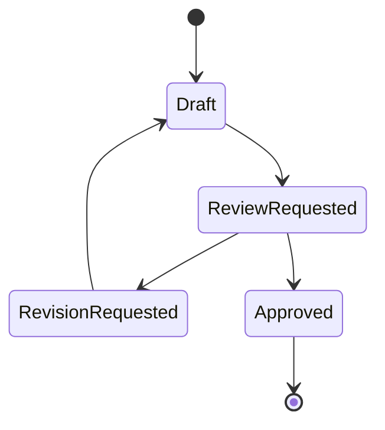
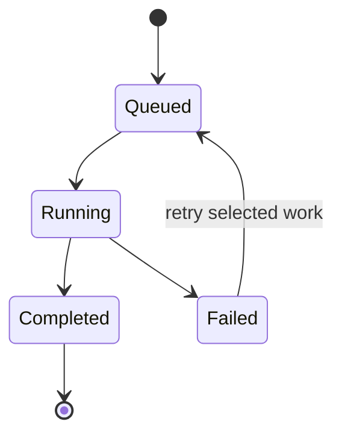

# LIGHTBRINGER workflow specification

## Purpose

This document defines the production stages, completion conditions, and recovery behavior of LIGHTBRINGER. The goal is to make AI animation work predictable enough for a team, not merely impressive in a single generation session.

## Stage model

| Stage | Primary owner | Input | Output | Completion condition |
|---|---|---|---|---|
| Screenplay review | Writer, reviewer | Natural-language screenplay | Approved source | Human approval recorded |
| Segment analysis | System | Approved source | Ordered work segments | Every source block belongs to a segment |
| Shot design and timing | Director, artist, LLM | One segment | Editable shots | Dialogue, directions, camera, and timing confirmed |
| Continuity and assets | Artist, supervisor | Confirmed shots, asset library | Shot-level asset locks | Every visible entity and location resolved |
| Prompt canon | Prompt artist, LLM | Locked shots and assets | Review and engine masters | Required masters present and reviewed |
| Storyboard / previz | Storyboard, layout | Prompt masters, asset references | Approved visual plan | Composition or layout accepted |
| Render approval | Producer | Selected shots, estimate | Approved render batch | Human accepts scope and expected cost |
| Render and review | Generation, editorial | Approved batch | Versioned outputs | Output accepted or retry reason recorded |

## Screenplay and review loop



The review system should preserve:

- the approved source;
- reviewer annotations;
- comments and authorship;
- previous revisions;
- the approval event.

Free-form comments are preferable to an excessive number of overlapping review states. The state machine should remain small while the conversation history stays complete.

## Segment strategy for long-form work

The entire screenplay may be analyzed as a source, but generation jobs operate on bounded segments.

Recommended rules:

- preserve scene headings, dialogue blocks, and explicit timing notes;
- target approximately 45–90 seconds per work segment;
- never split in the middle of a speaker block unless the source is malformed;
- assign stable segment order independent of completion time;
- paginate the explorer and load one selected segment's shots;
- show missing, queued, active, complete, and failed states directly in the explorer.

Late results must return to their original segment and shot order. API completion order must never become editorial order.

## Shot design contract

An LLM shot proposal should return distinct fields:

| Field | Rule |
|---|---|
| Dialogue | Spoken or vocalized content requiring performance or lip sync |
| Visual direction | What must be visible in frame, including the speaker |
| Audio direction | Non-dialogue sound, ambience, effects, music, or silence |
| Action / performance | Physical behavior, expression, intention, and beat |
| Framing | Close-up, medium, wide, insert, etc. |
| Camera | Angle, lens intent, movement, and stability |
| Duration | Whole seconds by default, with explicit recorded timing locked |

The operator must be able to:

- edit every field;
- split one shot;
- merge adjacent shots;
- exclude one shot without deleting the approved screenplay;
- restore an excluded shot;
- regenerate only the missing downstream output.

## Continuity and asset synchronization

Continuity is not a long memo detached from production. It is a shot-level state backed by asset identities.

```text
production entity
├── stable code          CHARACTER_A
├── human alias          @CHARACTER_A_BASE_V001
├── asset version        v001
├── appearance state     costume / injury / equipment
└── spatial state        location / screen direction / eyeline
```

Each shot should explicitly declare:

- visible characters and creatures;
- active location or background;
- required props, equipment, and variants;
- state changes entering and leaving the shot.

The segment-level asset shelf is a working library, not a fixed set. Artists can add and remove references, then choose the correct subset for each shot.

## Prompt canon

Shared scene instructions should not be repeated in every paid LLM request.

### Shared values

- visual medium and overall style;
- world and tone;
- aspect ratio;
- universal negative prompt;
- terminology and translation glossary.

### Shot-specific values

1. identity and visible `@assets`;
2. composition and framing;
3. blocking, distance, eyelines, and screen direction;
4. one clear action beat;
5. lighting and shot-specific look;
6. dialogue and sound;
7. only the additional negative risks unique to that shot.

### Compiled outputs

- **Structured source** — machine-editable layers.
- **Korean review master** — human creative review.
- **English video master** — model-facing motion generation.
- **English storyboard master** — still-image generation without unnecessary temporal/audio detail.
- **Shot negative** — optional; empty is valid when the common negative is sufficient.

## Queue and recovery behavior



Recommended execution:

1. Process a small batch for latency and cost efficiency.
2. Save every successfully parsed shot immediately.
3. If the batch response is truncated, malformed, or times out, retain completed shots.
4. Fall back to shot-level requests beginning at the failed position.
5. Expose progress, elapsed time, and the current operation.
6. Never require an entire screenplay or episode to be regenerated because one shot failed.

## Cost gate

Token-based analysis and credit-intensive media generation are different economic events.

Before an external render:

- select exact shots;
- snapshot the prompt and asset versions;
- estimate or display provider cost when available;
- require a human approval action;
- record approver, time, provider, and model;
- preserve every output attempt and retry reason.

No automatic video retry should occur without a studio-defined ceiling and explicit policy.
